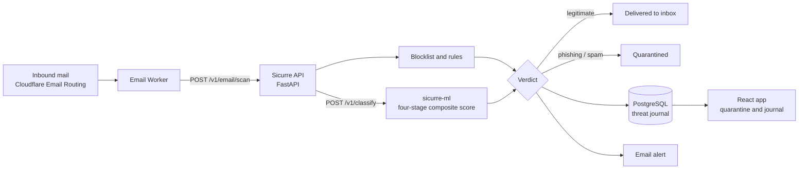

# Sicurre

[](https://github.com/MichAdebayo/sicurre/actions/workflows/ci.yml)
[](https://github.com/MichAdebayo/sicurre/actions/workflows/cd.yml)
[](pyproject.toml)
[](package.json)
[](https://github.com/MichAdebayo/sicurre-ml)
[](docs/adr/0001-cloudflare-email-routing-runtime.md)

Phishing detection for French auto-entrepreneurs and TPEs. Inbound mail for a
protected domain arrives through Cloudflare Email Routing; an Email Worker calls
the Sicurre API, which classifies the message with a fine-tuned CamemBERTaV2
model and returns a verdict before the Worker forwards, quarantines or rejects.

The decision happens **on the delivery path, not after it** — a phishing message
is held before it reaches the inbox rather than moved out of it once read. That
constraint is what sets the two-second budget every component below is designed
against.

This repository holds the data platform, the application and the API. The
model, its training pipeline and the ONNX inference service live in
[sicurre-ml](https://github.com/MichAdebayo/sicurre-ml).

> Earlier versions read mail through Gmail watches and moved phishing to Trash
> after delivery. That approach is superseded — see
> [ADR-0001](docs/adr/0001-cloudflare-email-routing-runtime.md) — and Gmail is no
> longer a runtime dependency.

## How a message is decided



Verdicts are written to the threat journal with the model version and revision
that produced them, and a classifier verdict carries a short plain-language
French explanation shown to the user beside it.

## Install and run

Requires Python 3.11+, [uv](https://docs.astral.sh/uv/), Docker, and a
PostgreSQL database. `make help` lists every target; the ones below are the path
from a clean checkout to a running platform.

```bash
uv sync                      # install dependencies
cp .env.example .env         # then fill in the values
uv run alembic upgrade head  # create the schema
```

`.env.example` is the configuration reference: every variable the platform reads
is listed and commented there.

### Verify the checkout

```bash
make check                   # lint, types, and the full test suite
make test-unit               # unit tests alone, no database required
```

### Data platform

The platform runs in three stages, and each is a separate target so a failure
stops at a known point rather than half-way through a pipeline.

```bash
make ingest-all-base         # one-off: load the base corpora into raw records
make collect                 # recurring: pull the day's deltas from every source
make process                 # normalize, generate, annotate
make release                 # freeze a dataset version, export, publish
```

`make release` is idempotent by design: with no new eligible records it runs
normalization, generation and annotation, then exits without building a dataset
version. That is why it can be scheduled daily without producing a release a
day.

### Run the application

```bash
make dev-api                 # API alone
make dev                     # full stack via Docker Compose
make dev-stop                # tear it down
```

## Repository layout

| Path | Contents |
|------|----------|
| `src/data_platform/` | Ingestion, processing and release pipeline; the FastAPI service and its routers |
| `src/app/` | React application — quarantine, threat journal, settings |
| `src/core/` | Shared domain logic: rules, MIME decoding, alerting, operational exercises |
| `src/db/` | SQLAlchemy models and the two Alembic migration trees |
| `src/poc/` | Standalone local runtime used for the proof of concept |
| `deploy/` | Production deployment — Compose files, Caddy, cron, runbooks |
| `tests/` | Unit, integration and end-to-end suites |

## Documentation

| Document | Covers |
|----------|--------|
| [Development, CI and CD](docs/ops/development-setup.md) | Tooling versions, database setup, the CI jobs, the delivery chain |
| [RGPD processing register](docs/data-platform/rgpd-register.md) | Purpose, legal basis, categories, retention and review procedures per source |
| [Logging and monitoring](docs/ops/logging-monitoring.md) | The metrics actually emitted, and which controls are declared but unverified |
| [deploy/README.md](deploy/README.md) | Production deployment |
| [docs/README.md](docs/README.md) | Documentation index |

Deeper material lives under `docs/`: `architecture/` (goals, system design, data
schema, NFRs, threat model), `adr/` (why key options were chosen), `api/` (the
OpenAPI contract and examples), `ops/` (SLOs, runbooks, incidents), `brand/` and
`research/`.

## Conventions

- Diagrams are Mermaid embedded in Markdown, so they render and diff as text
- ADRs are immutable: append a new record rather than rewriting an old one
- Least privilege, encryption of sensitive data, and minimal retention are assumed
- Changes reach production through `feature → app → develop → main`; CI gates
  `develop` and `main`, and CD deploys from `main`
