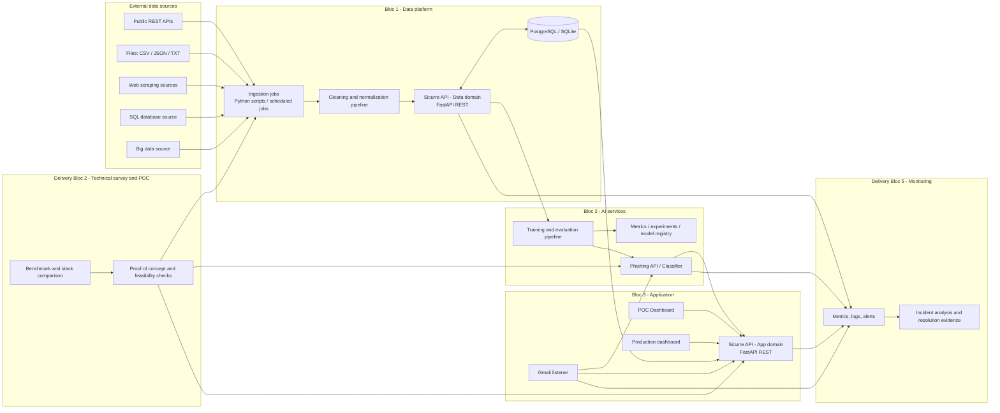

```md
# Component design (Certification-first architecture)

## Purpose

This document describes the target component architecture for the certification project.

It uses two complementary views:

1. official certification blocs: 3 blocs defined by the referential
2. internal delivery blocs: Bloc 0 plus 5 execution blocs used for planning and backlog management

The previous version of this document described the final SaaS product runtime only.
That view remains valid, but it is now treated as a downstream layer built on top of a dedicated data platform.

## Delivery framing

The implementation roadmap is organized as follows:

- Bloc 0: architecture freeze and execution baseline
- Bloc 1: data platform
- Bloc 2: technical survey and proof of concept
- Bloc 3: model and classifier service
- Bloc 4: application integration
- Bloc 5: monitoring and incident readiness

The technical architecture itself still groups runtime code into data, model, and application domains.
The survey and monitoring blocs exist as delivery and evidence phases layered on top of those domains.

## Architectural principle

Sicurre should be presented as a single platform with two bounded contexts inside the backend:

- Data platform context: ingestion, cleaning, normalization, curation, SQL storage, and REST exposure
- Product runtime context: user auth, inbox monitoring, remediation, audit log, and feedback

For certification purposes, the data platform is the primary architecture for Bloc 1.

The product runtime becomes a second layer that consumes curated data and model services.

## Target component map



## Official certification mapping

| Official certification bloc | Sicurre delivery interpretation |
|-----------------------------|---------------------------------|
| Bloc 1 | Delivery Bloc 1 data platform |
| Bloc 2 | Delivery Bloc 2 technical survey and POC plus Delivery Bloc 3 model |
| Bloc 3 | Delivery Bloc 4 app plus Delivery Bloc 5 monitoring |

## Bloc 1 components

The related issue note for the Bloc 1 source perimeter is documented in [issue-artifact.md](issue-artifact.md).

### 1. Source connectors

- Role: retrieve data from the mandatory source categories required by the certification
- Supported source types:
	- public REST API
	- data files
	- web scraping
	- SQL database source
	- big data source
- Current evidence in the repository:
	- API: PhishTank
	- files: CSV and TXT corpora
	- scraping: CERT-FR and other web sources
	- SQL source: SQLite notebook proof of concept
	- big data: BigQuery and Common Crawl work

### 2. Ingestion jobs

- Role: collect source payloads and register each execution as an ingestion run
- Responsibility:
	- fetch data
	- persist source metadata
	- store raw payload snapshots or references
	- extract first-level records
- Delivery form for certification:
	- Python scripts or scheduled jobs
	- documented parameters, logs, and outputs

### 3. Cleaning and normalization pipeline

- Role: transform raw records into reusable NLP-ready normalized messages
- Responsibility:
	- HTML stripping
	- Unicode normalization
	- language filtering
	- PII redaction
	- deduplication
	- class normalization
	- provenance preservation
- Existing groundwork already lives in the data processing scripts and notebooks

### 4. Sicurre API, data domain

- Role: expose curated data through a documented REST API
- Scope:
	- sources
	- ingestion runs
	- normalized messages
	- annotations
	- datasets and splits
- Security expectations:
	- authentication for write endpoints
	- authorization by role in later phases
	- rate limiting on public endpoints

### 5. Relational database

- Target database for MPD: PostgreSQL
- Development and CI compatibility: SQLite through the same ORM layer
- Role:
	- store lineage from source to curated message
	- support CRUD on curated entities
	- support auditability and RGPD retention rules

## Bloc 2 components

### 6. Technical survey and stack decision

- Role: justify the selected stack and lock implementation decisions before major implementation effort
- Responsibility:
	- benchmark candidate models, runtimes, frameworks, and services
	- document accepted and rejected options
	- capture the decision criteria that later validation will be checked against
- Primary repository evidence:
	- `docs/research/tech-stack-survey.md`
	- public architecture and planning docs
	- concise validation notes in `docs/architecture/issue-artifact.md`

### 7. Training and evaluation pipeline

- Role: consume curated datasets from the data platform and produce versioned models
- Inputs:
	- dataset versions
	- train/validation/test split metadata
	- annotation labels
- Outputs:
	- model artifact
	- metrics
	- evaluation reports

### 8. Phishing API / classifier service

- Role: expose the trained model through a dedicated REST API
- Responsibility:
	- 3-class classification
	- confidence scoring
	- auxiliary signals such as URL and authentication heuristics
- Constraint:
	- stateless service
	- no direct database access in deployed product architecture

### 9. Model observability layer

- Role: monitor model performance and service behavior
- Measures:
	- latency
	- verdict distribution
	- feedback drift
	- evaluation metrics by version

## Bloc 4 components

### 10. Pre-app validation evidence

- Role: confirm that the selected backend and inference path still hold once the first usable model baseline exists
- Timing:
	- after Bloc 3 delivers a usable model and model API baseline
	- before full Bloc 4 application integration
- Evidence form:
	- concise success criteria
	- measured validation notes
	- recorded conclusion in `docs/architecture/issue-artifact.md`

### 11. Sicurre API, application domain

- Role: expose user-facing product functionality
- Responsibility:
	- auth integration
	- user settings
	- threat log
	- feedback
	- restore and remediation endpoints

### 12. Gmail listener

- Role: receive push notifications, fetch message changes, call the classifier, then call the app domain to persist audit results
- Constraint:
	- idempotent processing is mandatory
	- no direct database access

### 13. POC dashboard

- Role: demonstrate the end-to-end flow during evaluation
- Candidate technology:
	- Streamlit for fast demonstration
- Constraint:
	- consumes the API only

### 14. Production dashboard

## Delivery Bloc 5 components

### 15. Monitoring and alerting stack

- Role: collect metrics, logs, and alert signals across data ingestion, classifier, and application runtime
- Responsibility:
	- availability checks
	- latency and error monitoring
	- remediation workflow visibility
	- alert triggering

### 16. Incident analysis workflow

- Role: support technical incident resolution and defense evidence
- Responsibility:
	- trace failures to their root cause
	- document corrective actions
	- link monitoring outputs to issues and fixes

- Role: future SaaS interface for users
- Candidate technology:
	- React/TypeScript
- Constraint:
	- consumes the API only

## Certification-oriented interface contracts

### Source connectors -> ingestion jobs

- Pull or receive source data
- Emit structured run metadata

### Ingestion jobs -> data domain API

- Register:
	- source systems
	- ingestion runs
	- raw objects
	- raw records

### Normalization pipeline -> data domain API

- Create or update:
	- normalized messages
	- annotations
	- dataset versions

### Data domain API -> training pipeline

- Read-only access to curated datasets and split definitions

### Classifier -> application domain API

- Write threat log entries and remediation outcomes through an internal contract

## Deployment boundaries

### Certification target

- One backend codebase is enough
- One relational database is enough
- Separate the platform by modules, not by premature microservices

### Recommended split inside the backend

- Data domain module
- Model domain module
- Application domain module

### Production constraint preserved

- In deployed runtime architecture, only the Sicurre API owns the database connection
- Gmail listener and classifier remain separate compute services and communicate over HTTP

