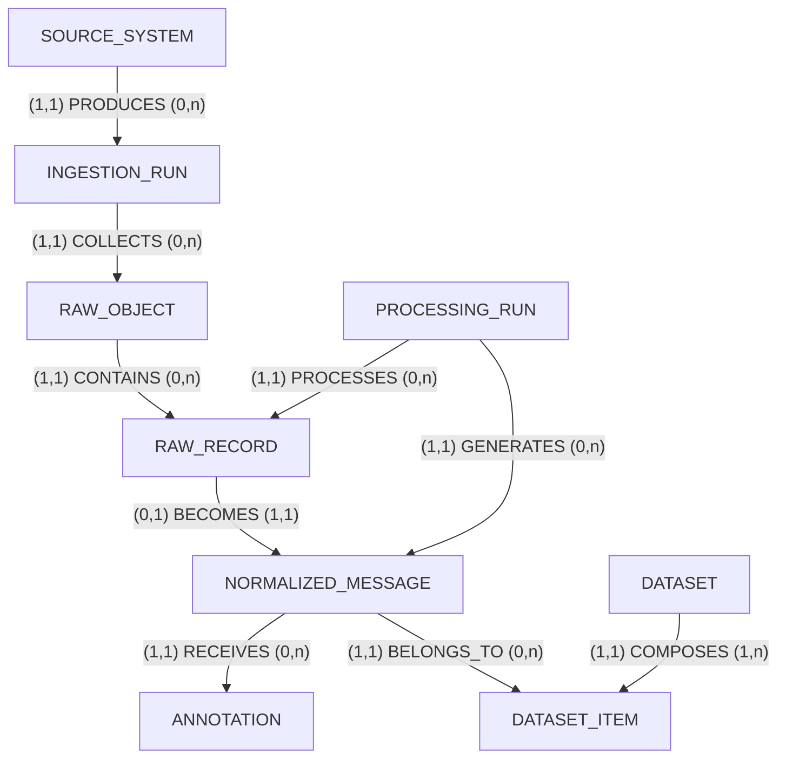
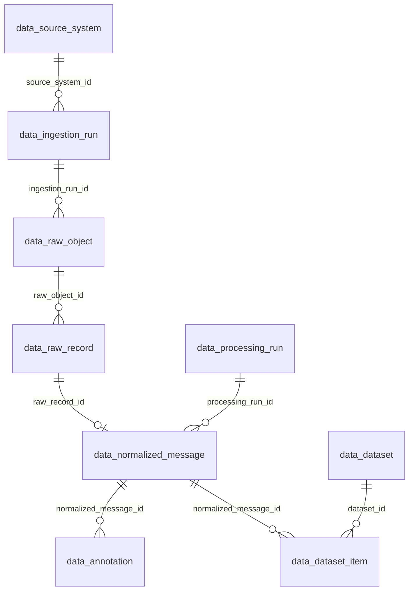

# Data design

## Purpose

This document now separates two distinct but related schemas:

1. the certification-facing data platform schema for Bloc 1
2. the product runtime schema for the SaaS application

The certification schema is the primary source of truth for MCD, MLD, and MPD.
The runtime schema remains necessary, but it is downstream from the data platform.

## Scope of the Bloc 1 data platform

The data platform must prove the following chain end to end:

- collect data from multiple source types
- aggregate and clean the data
- normalize and label usable NLP records
- store lineage in a relational database
- expose the curated data through a REST API

For this reason, the central business object is not the end user account.
It is the curated message dataset derived from heterogeneous sources.

## Frozen table naming convention

Table names are now frozen and must follow domain prefixes.

- `data_` for Bloc 1 data platform tables
- `ml_` for model lifecycle and evaluation tables
- `app_` for runtime application tables

This naming rule is part of the architecture baseline and should not be changed during implementation unless a new architecture decision record explicitly supersedes it.

## Merise MCD (conceptual model)

### Conceptual entities

| Entity | Main attributes | Identifier |
|--------|-----------------|------------|
| SOURCE_SYSTEM | name, source_type, description, owner_name, legal_basis, contains_personal_data, retention_days, is_active | id |
| INGESTION_RUN | started_at, finished_at, status, trigger_mode, raw_object_count, raw_record_count, log_message | id |
| RAW_OBJECT | external_ref, object_type, storage_uri, content_hash, collected_at, size_bytes, source_format, source_metadata | id |
| RAW_RECORD | record_key, raw_content, detected_language, extracted_at, is_usable | id |
| PROCESSING_RUN | started_at, finished_at, pipeline_version, status, normalized_count, rejected_count, report_uri | id |
| NORMALIZED_MESSAGE | normalized_text, text_sha256, language, current_label, quality_score, contains_pii, redaction_status, text_length, normalized_at | id |
| ANNOTATION | label, label_source, confidence, comment, annotated_at, is_validated | id |
| DATASET | name, version_tag, target_usage, frozen_at, status | id |
| DATASET_ITEM | split_name, sample_weight, row_order | id |

### Conceptual associations

- SOURCE_SYSTEM (1,1) — PRODUCES — (0,n) INGESTION_RUN
- INGESTION_RUN (1,1) — COLLECTS — (0,n) RAW_OBJECT
- RAW_OBJECT (1,1) — CONTAINS — (0,n) RAW_RECORD
- PROCESSING_RUN (1,1) — PROCESSES — (0,n) RAW_RECORD
- RAW_RECORD (0,1) — BECOMES — (1,1) NORMALIZED_MESSAGE
- PROCESSING_RUN (1,1) — GENERATES — (0,n) NORMALIZED_MESSAGE
- NORMALIZED_MESSAGE (1,1) — RECEIVES — (0,n) ANNOTATION
- DATASET (1,1) — COMPOSES — (1,n) DATASET_ITEM
- NORMALIZED_MESSAGE (1,1) — BELONGS_TO — (0,n) DATASET_ITEM

### Conceptual notes

- `SOURCE_SYSTEM` captures RGPD and governance information at the source level (e.g. PhishTank API, CERT-FR scrape, manual upload).
- `RAW_OBJECT` represents the collected payload or snapshot (file, API response, HTML page).
- `RAW_RECORD` represents a row, page, message, or extracted item inside a raw object.
- `PROCESSING_RUN` both processes raw records (tracking which records were attempted, including rejections) and generates normalized messages (its output). The GENERATES association justifies `processing_run_id` as a FK on `data_normalized_message`.
- `NORMALIZED_MESSAGE` is the reusable NLP unit after cleaning, deduplication, and redaction. Its `text_sha256` unique key prevents duplicate content across ingestion runs.
- `DATASET` and `DATASET_ITEM` allow versioned train, validation, and test sets. A normalized message can belong to multiple datasets over time.

### MCD diagram

## MLD diagram

```mermaid
erDiagram
    data_source_system {
        uuid id PK
        text name UK
        text source_type
        text owner_name
        text legal_basis
        boolean contains_personal_data
        integer retention_days
        boolean is_active
        timestamptz created_at
        timestamptz updated_at
    }

    data_ingestion_run {
        uuid id PK
        uuid source_system_id FK
        timestamptz started_at
        timestamptz finished_at
        text status
        text trigger_mode
        integer raw_object_count
        integer raw_record_count
        text log_message
        timestamptz created_at
    }

    data_raw_object {
        uuid id PK
        uuid ingestion_run_id FK
        text external_ref
        text object_type
        text storage_uri
        text source_format
        text content_hash
        bigint size_bytes
        jsonb source_metadata
        timestamptz collected_at
        timestamptz retention_until
        timestamptz created_at
    }

    data_raw_record {
        uuid id PK
        uuid raw_object_id FK
        text record_key
        text raw_content
        text detected_language
        boolean is_usable
        text rejection_reason
        timestamptz extracted_at
        timestamptz created_at
    }

    data_processing_run {
        uuid id PK
        text pipeline_version
        timestamptz started_at
        timestamptz finished_at
        text status
        integer normalized_count
        integer rejected_count
        text report_uri
        timestamptz created_at
    }

    data_normalized_message {
        uuid id PK
        uuid raw_record_id FK
        uuid processing_run_id FK
        text normalized_text
        text text_sha256 UK
        text language
        text current_label
        real quality_score
        boolean contains_pii
        text redaction_status
        integer text_length
        timestamptz normalized_at
        timestamptz created_at
        timestamptz updated_at
    }

    data_annotation {
        uuid id PK
        uuid normalized_message_id FK
        text label
        text label_source
        real confidence
        text comment
        boolean is_validated
        timestamptz annotated_at
        timestamptz created_at
    }

    data_dataset {
        uuid id PK
        text name
        text version_tag UK
        text target_usage
        text status
        timestamptz frozen_at
        integer item_count
        timestamptz created_at
        timestamptz updated_at
    }

    data_dataset_item {
        uuid id PK
        uuid dataset_id FK
        uuid normalized_message_id FK
        text split_name
        real sample_weight
        integer row_order
        timestamptz created_at
    }

    data_source_system ||--o{ data_ingestion_run : produces
    data_ingestion_run ||--o{ data_raw_object : collects
    data_raw_object ||--o{ data_raw_record : contains
    data_processing_run ||--o{ data_normalized_message : generates
    data_processing_run ||--o{ data_raw_record : processes
    data_raw_record ||--o| data_normalized_message : becomes
    data_normalized_message ||--o{ data_annotation : receives
    data_dataset ||--o{ data_dataset_item : composes
    data_normalized_message ||--o{ data_dataset_item : belongs_to
```

## MLD (logical relational model)

### Logical table list

| Table | Role | Key relationships |
|-------|------|-------------------|
| `data_source_system` | source catalog and governance registry | parent of ingestion runs |
| `data_ingestion_run` | execution trace for one collection run | child of source system |
| `data_raw_object` | collected file, payload, or snapshot | child of ingestion run |
| `data_raw_record` | extracted row, message, page, or unit | child of raw object |
| `data_processing_run` | execution trace for normalization pipeline | linked to raw records (processed) and normalized messages (generated) |
| `data_normalized_message` | curated NLP-ready message | child of raw record and processing run |
| `data_annotation` | labels and validation metadata | child of normalized message |
| `data_dataset` | frozen dataset version | parent of dataset items |
| `data_dataset_item` | membership of a message in a dataset split | child of dataset and normalized message |

### Logical constraints

- one source system can generate many ingestion runs
- one ingestion run can generate many raw objects
- one raw object can contain many raw records
- one raw record can yield zero or one normalized message
- one processing run processes many raw records and generates many normalized messages
- one normalized message can receive many annotations
- one dataset contains many dataset items
- one normalized message can belong to several datasets over time

### Logical enums

Controlled vocabularies for CHECK constraints:

- `source_type`: `api`, `file`, `scraping`, `sql`, `bigdata`, `manual`
- `status` for runs: `pending`, `running`, `completed`, `failed`, `partial`
- `object_type`: `file`, `api_payload`, `html_page`, `sql_export`, `bigdata_extract`
- `current_label` and `label`: `phishing`, `spam`, `legitimate`, `unknown`
- `split_name`: `train`, `val`, `test`, `holdout`
- `redaction_status`: `not_required`, `redacted`, `review_needed`

### Logical interpretation

- The MLD keeps a strict lineage from source system to dataset item.
- The curated NLP object is `data_normalized_message`.
- The relational model supports SQL queries for lineage, quality control, dataset composition, and API exposure.

## MPD (physical model for PostgreSQL)

### Target RDBMS

- Production target: PostgreSQL
- Local development and CI: SQLite via dialect abstraction
- Migration tool: Alembic

### MPD diagram

### Physical table definitions

#### `data_source_system`

| Column | Type | Constraints |
|--------|------|------------|
| id | uuid | PK, DEFAULT gen_random_uuid() |
| name | text | NOT NULL, UNIQUE |
| source_type | text | NOT NULL, CHECK(source_type IN ('api','file','scraping','sql','bigdata','manual')) |
| description | text | |
| owner_name | text | |
| legal_basis | text | |
| contains_personal_data | boolean | NOT NULL, DEFAULT false |
| retention_days | integer | |
| is_active | boolean | NOT NULL, DEFAULT true |
| created_at | timestamptz | NOT NULL, DEFAULT now() |
| updated_at | timestamptz | |

#### `data_ingestion_run`

| Column | Type | Constraints |
|--------|------|------------|
| id | uuid | PK |
| source_system_id | uuid | NOT NULL, FK -> data_source_system(id) ON DELETE RESTRICT |
| started_at | timestamptz | NOT NULL |
| finished_at | timestamptz | |
| status | text | NOT NULL, CHECK(status IN ('pending','running','completed','failed','partial')) |
| trigger_mode | text | NOT NULL |
| raw_object_count | integer | NOT NULL, DEFAULT 0 |
| raw_record_count | integer | NOT NULL, DEFAULT 0 |
| log_message | text | |
| created_at | timestamptz | NOT NULL, DEFAULT now() |

Index strategy:

- `idx_ingestion_source_started` on `(source_system_id, started_at DESC)`

#### `data_raw_object`

| Column | Type | Constraints |
|--------|------|------------|
| id | uuid | PK |
| ingestion_run_id | uuid | NOT NULL, FK -> data_ingestion_run(id) ON DELETE CASCADE |
| external_ref | text | |
| object_type | text | NOT NULL, CHECK(object_type IN ('file','api_payload','html_page','sql_export','bigdata_extract')) |
| storage_uri | text | |
| source_format | text | |
| content_hash | text | NOT NULL |
| size_bytes | bigint | |
| source_metadata | jsonb | NOT NULL, DEFAULT '{}' |
| collected_at | timestamptz | NOT NULL |
| retention_until | timestamptz | |
| created_at | timestamptz | NOT NULL, DEFAULT now() |

Index strategy:

- `idx_raw_object_ingestion` on `(ingestion_run_id)`
- `uq_raw_object_hash` UNIQUE `(content_hash, external_ref)`

#### `data_raw_record`

| Column | Type | Constraints |
|--------|------|------------|
| id | uuid | PK |
| raw_object_id | uuid | NOT NULL, FK -> data_raw_object(id) ON DELETE CASCADE |
| record_key | text | NOT NULL |
| raw_content | text | NOT NULL |
| detected_language | text | |
| is_usable | boolean | NOT NULL, DEFAULT true |
| rejection_reason | text | |
| extracted_at | timestamptz | NOT NULL |
| created_at | timestamptz | NOT NULL, DEFAULT now() |

Index strategy:

- `uq_raw_record_key` UNIQUE `(raw_object_id, record_key)`

#### `data_processing_run`

| Column | Type | Constraints |
|--------|------|------------|
| id | uuid | PK |
| pipeline_version | text | NOT NULL |
| started_at | timestamptz | NOT NULL |
| finished_at | timestamptz | |
| status | text | NOT NULL, CHECK(status IN ('pending','running','completed','failed','partial')) |
| normalized_count | integer | NOT NULL, DEFAULT 0 |
| rejected_count | integer | NOT NULL, DEFAULT 0 |
| report_uri | text | |
| created_at | timestamptz | NOT NULL, DEFAULT now() |

#### `data_normalized_message`

| Column | Type | Constraints |
|--------|------|------------|
| id | uuid | PK |
| raw_record_id | uuid | NOT NULL, FK -> data_raw_record(id) ON DELETE RESTRICT |
| processing_run_id | uuid | NOT NULL, FK -> data_processing_run(id) ON DELETE RESTRICT |
| normalized_text | text | NOT NULL |
| text_sha256 | text | NOT NULL, UNIQUE |
| language | text | NOT NULL |
| current_label | text | NOT NULL, CHECK(current_label IN ('phishing','spam','legitimate','unknown')) |
| quality_score | real | |
| contains_pii | boolean | NOT NULL, DEFAULT false |
| redaction_status | text | NOT NULL, DEFAULT 'not_required', CHECK(redaction_status IN ('not_required','redacted','review_needed')) |
| text_length | integer | NOT NULL |
| normalized_at | timestamptz | NOT NULL |
| created_at | timestamptz | NOT NULL, DEFAULT now() |
| updated_at | timestamptz | |

Index strategy:

- `idx_message_label_lang` on `(current_label, language)`
- `idx_message_processing_run` on `(processing_run_id)`

#### `data_annotation`

| Column | Type | Constraints |
|--------|------|------------|
| id | uuid | PK |
| normalized_message_id | uuid | NOT NULL, FK -> data_normalized_message(id) ON DELETE CASCADE |
| label | text | NOT NULL, CHECK(label IN ('phishing','spam','legitimate','unknown')) |
| label_source | text | NOT NULL |
| confidence | real | CHECK(confidence BETWEEN 0 AND 1) |
| comment | text | |
| is_validated | boolean | NOT NULL, DEFAULT false |
| annotated_at | timestamptz | NOT NULL |
| created_at | timestamptz | NOT NULL, DEFAULT now() |

Index strategy:

- `idx_annotation_message_date` on `(normalized_message_id, annotated_at DESC)`

#### `data_dataset`

| Column | Type | Constraints |
|--------|------|------------|
| id | uuid | PK |
| name | text | NOT NULL |
| version_tag | text | NOT NULL, UNIQUE |
| target_usage | text | NOT NULL |
| status | text | NOT NULL, CHECK(status IN ('draft','frozen','archived')) |
| frozen_at | timestamptz | |
| item_count | integer | NOT NULL, DEFAULT 0 |
| created_at | timestamptz | NOT NULL, DEFAULT now() |
| updated_at | timestamptz | |

#### `data_dataset_item`

| Column | Type | Constraints |
|--------|------|------------|
| id | uuid | PK |
| dataset_id | uuid | NOT NULL, FK -> data_dataset(id) ON DELETE CASCADE |
| normalized_message_id | uuid | NOT NULL, FK -> data_normalized_message(id) ON DELETE RESTRICT |
| split_name | text | NOT NULL, CHECK(split_name IN ('train','val','test','holdout')) |
| sample_weight | real | NOT NULL, DEFAULT 1.0 |
| row_order | integer | |
| created_at | timestamptz | NOT NULL, DEFAULT now() |

Index strategy:

- `uq_dataset_message` UNIQUE `(dataset_id, normalized_message_id)`
- `idx_dataset_split` on `(dataset_id, split_name)`

## CRUD policy for the data platform

Not every table should be equally mutable.

### Full CRUD

- `data_source_system`
- `data_annotation`
- `data_dataset`
- `data_dataset_item` while the dataset is still in `draft`

### Create and read, controlled updates only

- `data_normalized_message`
  - allowed updates: corrected label, redaction status, quality metadata

### Append-only with retention-driven deletion

- `data_ingestion_run`
- `data_raw_object`
- `data_raw_record`
- `data_processing_run`

This preserves lineage and makes the SQL platform defensible during evaluation.

## RGPD and retention rules

- raw content is retained only as long as necessary for reproducibility and audit
- normalized text must be redacted before long-term retention
- source-level legal basis and retention are tracked in `data_source_system`
- records may be deleted by retention policy from raw tables without breaking dataset history if curated text is preserved lawfully

## Secondary schema: product runtime model

The following runtime entities remain valid for the final SaaS application, but they are not the primary MCD for Bloc 1:

- `app_user`
- `app_oauth_token`
- `app_watch_state`
- `app_threat_log`
- `app_feedback`
- `ml_model_version`
- `app_session`

These runtime tables should be documented and implemented as a separate application-domain schema after the data platform baseline is established.
