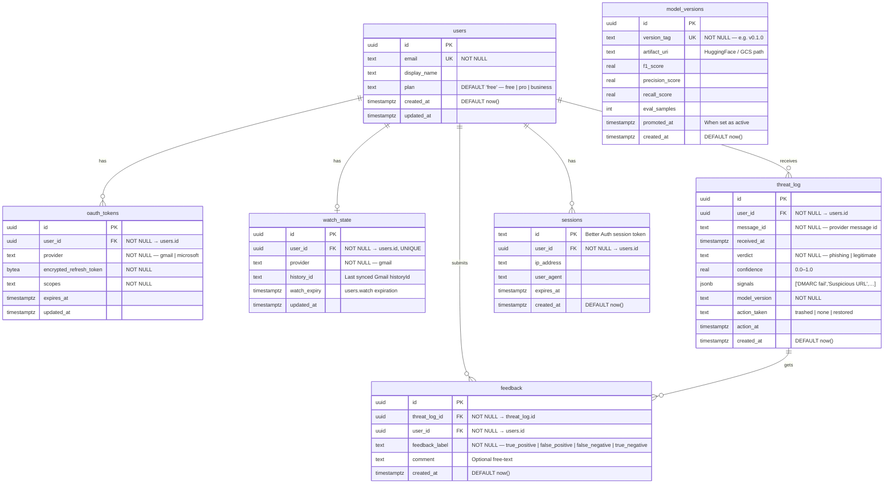

# Data design

## Data classes
- User identity + OAuth linkage (minimal)
- Email metadata for audit (minimal)
- Optional: anonymized email text for model improvements (time-limited)

## Entity-Relationship Diagram (Mermaid)

## Merise MCD (Conceptual — for Simplon Bloc 1 C4)

| Entity | Attributes | Identifiant |
|--------|-----------|-------------|
| UTILISATEUR | email, display_name, plan, created_at | id |
| JETON_OAUTH | provider, encrypted_refresh_token, scopes, expires_at | id |
| ETAT_WATCH | provider, history_id, watch_expiry | id |
| JOURNAL_MENACE | message_id, received_at, verdict, confidence, signals, model_version, action_taken, action_at | id |
| RETOUR_UTILISATEUR | feedback_label, comment, created_at | id |
| VERSION_MODELE | version_tag, artifact_uri, f1_score, precision, recall, eval_samples, promoted_at | id |
| SESSION | ip_address, user_agent, expires_at, created_at | id |

**Associations:**
- UTILISATEUR (1,1) — POSSEDE — (0,n) JETON_OAUTH
- UTILISATEUR (1,1) — SURVEILLE — (0,1) ETAT_WATCH
- UTILISATEUR (1,1) — RECOIT — (0,n) JOURNAL_MENACE
- UTILISATEUR (1,1) — SOUMET — (0,n) RETOUR_UTILISATEUR
- JOURNAL_MENACE (1,1) — CONCERNE — (0,n) RETOUR_UTILISATEUR
- UTILISATEUR (1,1) — OUVRE — (0,n) SESSION

## Tables (detailed)

### `users`
| Column | Type | Constraints |
|--------|------|------------|
| id | uuid | PK, DEFAULT gen_random_uuid() |
| email | text | NOT NULL, UNIQUE |
| display_name | text | |
| plan | text | NOT NULL, DEFAULT 'free', CHECK(plan IN ('free','pro','business')) |
| created_at | timestamptz | NOT NULL, DEFAULT now() |
| updated_at | timestamptz | |

### `oauth_tokens`
| Column | Type | Constraints |
|--------|------|------------|
| id | uuid | PK |
| user_id | uuid | NOT NULL, FK → users(id) ON DELETE CASCADE |
| provider | text | NOT NULL, CHECK(provider IN ('gmail','microsoft')) |
| encrypted_refresh_token | bytea | NOT NULL |
| scopes | text | NOT NULL |
| expires_at | timestamptz | |
| updated_at | timestamptz | |

**Index:** `idx_oauth_user_provider` UNIQUE (user_id, provider)

### `watch_state`
| Column | Type | Constraints |
|--------|------|------------|
| id | uuid | PK |
| user_id | uuid | NOT NULL, FK → users(id) ON DELETE CASCADE, UNIQUE |
| provider | text | NOT NULL, DEFAULT 'gmail' |
| history_id | text | Last synced Gmail historyId |
| watch_expiry | timestamptz | |
| updated_at | timestamptz | |

### `threat_log`
| Column | Type | Constraints |
|--------|------|------------|
| id | uuid | PK |
| user_id | uuid | NOT NULL, FK → users(id) |
| message_id | text | NOT NULL |
| received_at | timestamptz | |
| verdict | text | NOT NULL, CHECK(verdict IN ('phishing','legitimate')) |
| confidence | real | CHECK(confidence BETWEEN 0 AND 1) |
| signals | jsonb | DEFAULT '[]' |
| model_version | text | NOT NULL |
| action_taken | text | CHECK(action_taken IN ('trashed','none','restored')) |
| action_at | timestamptz | |
| created_at | timestamptz | NOT NULL, DEFAULT now() |

**Indexes:** `idx_threat_user_date` (user_id, created_at DESC), `idx_threat_message` UNIQUE (user_id, message_id) — idempotency guard

### `feedback`
| Column | Type | Constraints |
|--------|------|------------|
| id | uuid | PK |
| threat_log_id | uuid | NOT NULL, FK → threat_log(id) ON DELETE CASCADE |
| user_id | uuid | NOT NULL, FK → users(id) |
| feedback_label | text | NOT NULL, CHECK(feedback_label IN ('true_positive','false_positive','false_negative','true_negative')) |
| comment | text | |
| created_at | timestamptz | NOT NULL, DEFAULT now() |

**Index:** `idx_feedback_threat` UNIQUE (threat_log_id, user_id) — one feedback per user per threat

### `model_versions`
| Column | Type | Constraints |
|--------|------|------------|
| id | uuid | PK |
| version_tag | text | NOT NULL, UNIQUE |
| artifact_uri | text | |
| f1_score | real | |
| precision_score | real | |
| recall_score | real | |
| eval_samples | integer | |
| promoted_at | timestamptz | |
| created_at | timestamptz | NOT NULL, DEFAULT now() |

### `sessions` (managed by Better Auth)
| Column | Type | Constraints |
|--------|------|------------|
| id | text | PK |
| user_id | uuid | NOT NULL, FK → users(id) ON DELETE CASCADE |
| ip_address | text | |
| user_agent | text | |
| expires_at | timestamptz | NOT NULL |
| created_at | timestamptz | NOT NULL, DEFAULT now() |

## Retention policy (default)
- Audit metadata: 12 months
- Raw email bodies: 0 days (do not store) OR 7–90 days if user opts in
- Anonymized training text: 90 days rolling, then delete
- Sessions: expire after 30 days, hard-delete on logout

## Anonymization rules (if storing text)
- Replace emails with `[EMAIL]`
- Replace phone numbers with `[PHONE]`
- Replace IBAN with `[IBAN]`
- Replace URLs with `[URL]` (store domain separately if needed)
