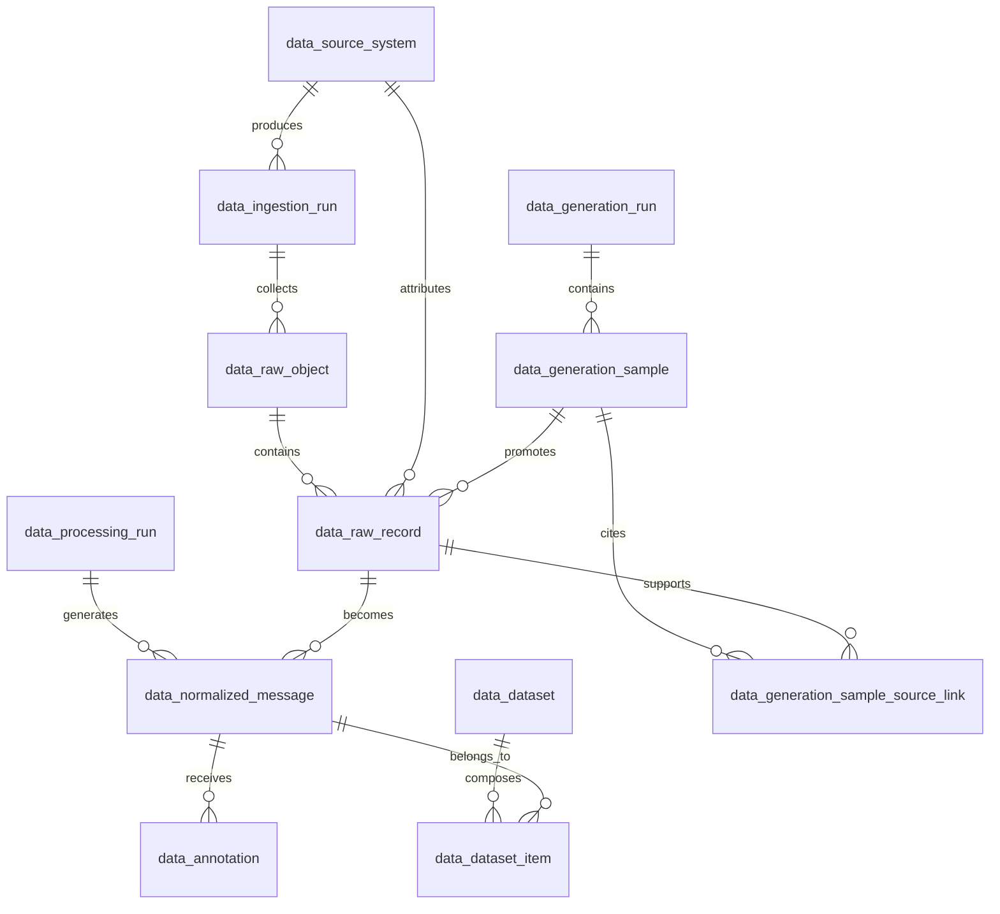

# Data Design

## Status

This document is the current schema reference for the Sicurre data platform as
of 2026-07-08. It replaces the earlier migration-story documentation: the data
platform is still pre-production, so the database can be rebuilt from a single
current baseline instead of replaying historical exploratory migrations.

Canonical implementation sources:

- ORM: `src/db/models/lineage.py`
- Alembic baseline: `src/db/migrations/versions/20260708_0001_current_baseline.py`
- PostgreSQL reference: `src/db/sql/sicurre.sql`

Local development and the Streamlit POC use SQLite. Production remains
PostgreSQL-compatible through SQLAlchemy and Alembic.

## Scope

The data platform owns the dataset-production chain:

1. collect raw data from API, file, scraping, database, and big-data sources
2. persist raw objects and raw records with lineage
3. normalize usable message-like records
4. annotate and validate labels
5. build frozen dataset versions
6. export train/val/test artifacts
7. publish the frozen version to Kaggle
8. dispatch the ML repository retraining workflow

Product runtime tables for the TypeScript application are intentionally outside
this schema. The only user table here is `poc_user`, which exists for the
Streamlit POC.

## Source Coverage

| Parent category | Implemented child sources | Runtime shape |
|---|---|---|
| API | PhishTank online valid feed | base ingestion + scheduled cron |
| File | local/R2 CSV and TXT datasets | base ingestion + scheduled R2 dropzone cron |
| Scraping | CERT-FR CTI, SAP Labs base snapshots, SEKOIA Community IOC | base ingestion where static, scheduled cron where dynamic |
| Database | seeded historical external threat DB | base ingestion + scheduled generated SQL feed |
| Big data | Common Crawl extracts | base ingestion + scheduled resumable extractor |

SEKOIA Community IOC is represented as a scraping child source named
`sekoia-community-ioc`. It stores public indicators of compromise as raw
intelligence records for blocklist/inference support. It is not treated as
email-body training text until a later reviewed promotion step explicitly
converts an item into a normalized message.

## Conceptual Model

| Entity | Role |
|---|---|
| `data_source_system` | source catalog and governance metadata |
| `data_ingestion_run` | one collection execution for one source |
| `data_raw_object` | fetched file, API payload, HTML page, PDF, SQL export, or big-data extract |
| `data_raw_record` | row, IOC, page candidate, message, or other item extracted from a raw object |
| `data_processing_run` | normalization execution |
| `data_normalized_message` | NLP-ready message text with current label and quality metadata |
| `data_annotation` | validation and label evidence for normalized messages |
| `data_dataset` | versioned dataset metadata and publish state |
| `data_dataset_item` | membership of normalized messages in train/val/test/holdout splits |
| `data_generation_run` | generation/evaluation execution metadata |
| `data_generation_sample` | staged generated draft with review state |
| `data_generation_sample_source_link` | provenance bridge from generated drafts to raw records |
| `pipeline_state` | durable JSON checkpoint for resumable cron jobs |
| `poc_user` | Streamlit POC authentication table |



## Current Physical Tables

### `data_source_system`

Catalogs every upstream source and its governance metadata.

Key columns: `id`, `name`, `source_type`, `description`, `owner_name`,
`legal_basis`, `contains_personal_data`, `retention_days`, `is_active`,
`created_at`, `updated_at`.

Allowed `source_type` values: `api`, `file`, `scraping`, `sql`, `bigdata`,
`manual`.

### `data_ingestion_run`

Tracks one source collection attempt.

Key columns: `id`, `source_system_id`, `started_at`, `finished_at`, `status`,
`trigger_mode`, `raw_object_count`, `raw_record_count`, `log_message`,
`created_at`.

Allowed `status` values: `pending`, `running`, `completed`, `failed`,
`partial`.

`trigger_mode` is operational text. Current values are `manual` and
`scheduled`.

### `data_raw_object`

Stores one collected object or snapshot.

Key columns: `id`, `ingestion_run_id`, `external_ref`, `object_type`,
`storage_uri`, `source_format`, `content_hash`, `size_bytes`,
`source_metadata`, `collected_at`, `retention_until`, `created_at`.

Allowed `object_type` values: `file`, `api_payload`, `html_page`,
`pdf_document`, `sql_export`, `bigdata_extract`.

Uniqueness: `(content_hash, external_ref)`.

### `data_raw_record`

Stores the extracted units inside a raw object.

Key columns: `id`, `raw_object_id`, `source_system_id`,
`generation_sample_id`, `record_key`, `raw_content`, `detected_language`,
`is_usable`, `rejection_reason`, `extracted_at`, `created_at`.

`source_system_id` is nullable for backward compatibility but should be set by
new ingestion code. `generation_sample_id` links a promoted generated row to the
reviewed generation sample that produced it.

Uniqueness: `(raw_object_id, record_key)`.

### `data_processing_run`

Tracks one normalization pass.

Key columns: `id`, `pipeline_version`, `started_at`, `finished_at`, `status`,
`normalized_count`, `rejected_count`, `report_uri`, `created_at`.

### `data_normalized_message`

Stores reusable NLP-ready message text.

Key columns: `id`, `raw_record_id`, `processing_run_id`, `normalized_text`,
`text_sha256`, `language`, `current_label`, `quality_score`, `contains_pii`,
`redaction_status`, `text_length`, `normalized_at`, `created_at`,
`updated_at`.

Allowed labels: `phishing`, `spam`, `legitimate`, `unknown`.
Allowed redaction states: `not_required`, `redacted`, `review_needed`.

Uniqueness: `text_sha256`.

### `data_annotation`

Stores label evidence and validation state.

Key columns: `id`, `normalized_message_id`, `label`, `label_source`,
`confidence`, `comment`, `is_validated`, `annotated_at`, `created_at`.

Allowed labels: `phishing`, `spam`, `legitimate`, `unknown`.
`confidence` must be between 0 and 1 when present.

### `data_dataset`

Stores frozen dataset versions and publish state.

Key columns: `id`, `name`, `version_tag`, `target_usage`, `status`,
`frozen_at`, `item_count`, `kaggle_version_id`, `published_at`, `created_at`,
`updated_at`.

Allowed statuses: `draft`, `frozen`, `archived`.
`kaggle_version_id` and `published_at` are written only after Kaggle publish
succeeds.

### `data_dataset_item`

Stores the split membership for a dataset version.

Key columns: `id`, `dataset_id`, `normalized_message_id`, `split_name`,
`sample_weight`, `row_order`, `created_at`.

Allowed split names: `train`, `val`, `test`, `holdout`.
Uniqueness: `(dataset_id, normalized_message_id)`.

### `data_generation_run`

Stores one generation or evaluation pass.

Key columns: `id`, `generator_name`, `source_name`, `parent_source`,
`reference_selection_mode`, artifact URI fields, `status`,
`total_draft_count`, `usable_draft_count`, `needs_prompt_tuning_count`,
`dropped_draft_count`, `created_at`, `started_at`, `finished_at`.

### `data_generation_sample`

Stores one generated draft variant and its review state.

Key columns: `id`, `generation_run_id`, `draft_id`, `scenario_id`,
`variant_index`, `source_name`, `parent_source`, `target_label`,
`primary_theme`, `review_state`, `review_notes`, `text_sha256`,
`nearest_reference_raw_record_id`, `nearest_similarity`, `created_at`.

Allowed review states: `usable`, `needs_prompt_tuning`, `drop`.
Uniqueness: `(generation_run_id, draft_id, variant_index)`.

### `data_generation_sample_source_link`

Stores provenance from a generated sample back to raw records used as seeds,
inputs, or nearest references.

Key columns: `id`, `generation_sample_id`, `raw_record_id`, `link_role`,
`link_order`, `created_at`.

Allowed link roles: `generation_seed`, `sample_input`, `nearest_reference`.
Uniqueness: `(generation_sample_id, raw_record_id, link_role)`.

### `pipeline_state`

Stores resumable cron checkpoints, currently used by long-running pipelines
such as Common Crawl.

Key columns: `id`, `pipeline_name`, `state_data`, `updated_at`, `created_at`.

### `poc_user`

Stores POC-only users for the Streamlit application.

Key columns: `id`, `email`, `display_name`, `password_hash`, `role`,
`created_at`, `last_login_at`.

Allowed roles by convention: `admin`, `viewer`.

## SQLite UUID Rule

SQLite can hold SQLAlchemy UUID values as either 32-character hex strings or
36-character hyphenated strings depending on how rows were produced. Local POC
and replay flows therefore compare UUIDs through normalized text joins in the
dataset and normalized-message query layer:

```sql
lower(replace(CAST(left_uuid AS TEXT), '-', '')) =
lower(replace(CAST(right_uuid AS TEXT), '-', ''))
```

This is a compatibility guard for local SQLite only. PostgreSQL still stores
and compares true UUID values.

## Dataset Publishing

Publishing is a deliberate release action, not a side effect of every source
cron run.

1. A dataset must be `frozen`.
2. The export service writes train/val/test artifacts.
3. The publish service pushes a new Kaggle dataset version.
4. `data_dataset.kaggle_version_id` and `data_dataset.published_at` are written.
5. The service dispatches the ML repository training workflow through GitHub
   Actions `workflow_dispatch`.

The current placeholder `train.csv` in Kaggle was only a connectivity smoke
test. The real workflow is the frozen dataset export plus publish endpoint.

## Model Provenance And Promotion

MLflow remains authoritative for experiment parameters, complete metrics,
evaluation artifacts, and registry versions. Sicurre stores only operational
lineage needed to explain which immutable model was evaluated, approved, and
deployed:

- `data_evaluation_set` registers an immutable, human-reviewed evaluation-only
  JSONL asset. It has its own R2 URI/checksum and cannot enter training splits.
- `ml_model_version` links one candidate to its frozen `data_dataset`, semantic
  model version, service source revision, GitHub training run, MLflow
  run/version, and immutable Hugging Face repository revision.
- `ml_model_evaluation` links candidate and incumbent to the same approved
  evaluation-set version. Its small metric snapshot records only weighted F1,
  phishing recall, and legitimate false-positive counts used by the decision;
  full evidence remains in the referenced MLflow evaluation run.
- `ml_model_deployment` records the result of the manually approved promotion
  workflow, approver, immutable deployed revision, previous model, and rollback
  or failure evidence.

Training always creates a `candidate`. Promotion is never a training side
effect. The owner reviews MLflow evidence, manually dispatches the Sicurre-ML
promotion workflow, and approves its single GitHub `production` environment.
Only a passing evaluation plus a successful deployment callback changes the
recorded production model; the incumbent is then retained as `retired` for
deterministic rollback.

## CRUD Policy

Full CRUD:

- `data_source_system`
- `data_annotation`
- draft `data_dataset` and `data_dataset_item`
- `poc_user`

Controlled updates:

- `data_normalized_message`: corrected label, redaction, and quality metadata
- `data_dataset`: publish fields after a successful Kaggle push
- `pipeline_state`: checkpoint replacement by the owning pipeline

Append-only except for retention or full local rebuild:

- `data_ingestion_run`
- `data_raw_object`
- `data_raw_record`
- `data_processing_run`
- generation lineage tables

## Retention and Privacy

- Raw data is retained only as long as needed for reproducibility and audit.
- Personal data flags live on the source and normalized-message layers.
- PII-bearing text should be redacted before it becomes normalized training
  data.
- SEKOIA IOC records are public threat-intelligence indicators and are stored
  as raw intelligence, not as user email content.
