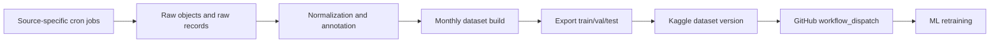

# Data Platform Cadence

## Decision

Source ingestion cadence and training-publication cadence are intentionally
decoupled.

Source cron jobs collect data at the frequency that makes sense for each
upstream source. A separate dataset release job decides when accumulated,
validated records should become a new frozen training dataset and be published
to Kaggle.

## Why

The five parent data-source categories do not update at the same speed:

| Parent source | Child source examples | Collection cadence |
|---|---|---|
| API | PhishTank | daily, because the feed changes frequently |
| File | R2 file dropzone | daily or operator-triggered, because source files are event-driven |
| Scraping | CERT-FR CTI | weekly or monthly, because relevant advisories are less frequent |
| Scraping | SEKOIA Community IOC | weekly by default, daily during active phishing-campaign monitoring |
| Database | generated external threat feed | weekly/monthly, because it is controlled by us |
| Big data | Common Crawl | monthly, because extraction is heavier and slower |

Training should not fire every time one source changes. It should run only when
the curated dataset has enough validated delta to justify a new model-training
version.

## Runtime Shape

1. Source cron jobs write raw objects and raw records.
2. Normalization and annotation promote only usable records.
3. Dataset build creates a frozen version from validated normalized messages.
4. Dataset export serializes train/val/test artifacts.
5. Dataset publish pushes the version to Kaggle.
6. Publish dispatches the ML repository training workflow through GitHub
   Actions `workflow_dispatch`.

## Production Scheduler Recommendation

When deployed as a separate container, the data platform should own its own
scheduler. The application container should not run ingestion jobs.

Recommended production cadence:

- `phishtank`: daily
- `file`: daily, plus manual operator run when a new file is dropped
- `sekoia`: weekly by default; daily during active phishing campaign monitoring
- `certfr`: weekly
- `database_historical`: monthly
- `common_crawl`: monthly with resumable checkpoints; scans recent indexes first
  across a bounded lookback window (`SICURRE_CC_CRON_LOOKBACK_INDICES`, default
  `18`) and skips completed indexes. `CC-MAIN-2025-08` is the base cutoff: the
  frozen base artifacts cover selected historical CC indexes through that point,
  and cron territory starts with newer indexes.
- `dataset_release`: monthly after all selected source jobs, normalization, and
  annotation complete successfully

Common Crawl checkpoint semantics:

- A CC index is written to `completed_indices` only after the whole index
  finishes.
- If the job times out mid-index, partial R2 snapshots may still be flushed, but
  the index is recorded under `timed_out_indices` and retried by a later cron.
- Hard index-level failures retry with
  `SICURRE_CC_CRON_INDEX_MAX_ATTEMPTS` (default `3`) and
  `SICURRE_CC_CRON_INDEX_RETRY_BACKOFF_SECONDS` (default `60`). Exhausted
  failures are recorded under `failed_indices`, not treated as complete.

As of July 8, 2026, live Common Crawl `collinfo.json` starts at
`CC-MAIN-2026-25`. With the default lookback of `18`, the cron can see the full
current post-base backlog:
`CC-MAIN-2026-25`, `2026-21`, `2026-17`, `2026-12`, `2026-08`, `2026-04`,
`2025-51`, `2025-47`, `2025-43`, `2025-38`, `2025-33`, `2025-30`,
`2025-26`, `2025-21`, `2025-18`, and `2025-13`.
Setting a minimum around January 2025 is reasonable as a human policy boundary,
but the operational cutoff should remain `CC-MAIN-2025-08` because that is the
known base index already represented in the frozen Common Crawl base artifacts.

The monthly release should be gate-based:

- latest source jobs must not be failed
- normalized dataset delta must be above a configured threshold
- label distribution must remain acceptable
- train/val/test export must succeed locally before Kaggle publish
- Kaggle publish must succeed before GitHub retraining dispatch

## Local Development

Local work can continue on SQLite while the pipeline is being stabilized. The
current pre-production baseline allows deleting and recreating the local DB
without migration debt. Production deployment can later point the same schema
at PostgreSQL/Neon once the flow is stable.

## Kaggle Placeholder Artifact

The original single-file Kaggle `train.csv` was a connectivity smoke test, not
a valid training dataset release. It has been superseded by a frozen replay
publish containing `train.csv`, `val.csv`, and `test.csv` generated from
`data_dataset.version_tag = 20260506-075504`.
