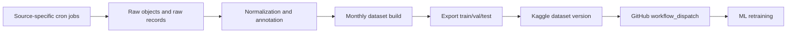

# Data Platform Cadence

## Decision

Source ingestion cadence and training-publication cadence are intentionally
decoupled.

Source cron jobs collect data at the frequency that makes sense for each
upstream source. A separate dataset release job decides when accumulated,
validated records should become a new frozen training dataset and be published
to Kaggle.

## Why

The five parent data-source categories do not update at the same speed:

| Parent source | Child source examples | Collection cadence |
|---|---|---|
| API | PhishTank | daily, because the feed changes frequently |
| File | R2 file dropzone | daily or operator-triggered, because source files are event-driven |
| Scraping | CERT-FR CTI | weekly or monthly, because relevant advisories are less frequent |
| Scraping | SEKOIA Community IOC | weekly by default, daily during active phishing-campaign monitoring |
| Database | generated external threat feed | weekly/monthly, because it is controlled by us |
| Big data | Common Crawl | monthly, because extraction is heavier and slower |

Training should not fire every time one source changes. It should run only when
the curated dataset has enough validated delta to justify a new model-training
version.

## Runtime Shape

1. Source cron jobs write raw objects and raw records.
2. Normalization and annotation promote only usable records.
3. Dataset build creates a frozen version from validated normalized messages.
4. Dataset export serializes train/val/test artifacts.
5. Dataset publish pushes the version to Kaggle.
6. Publish dispatches the ML repository training workflow through GitHub
   Actions `workflow_dispatch`.

## Production Scheduler Recommendation

When deployed as a separate container, the data platform should own its own
scheduler. The application container should not run ingestion jobs.

Recommended production cadence:

- `phishtank`: daily
- `file`: daily, plus manual operator run when a new file is dropped
- `sekoia`: weekly by default; daily during active phishing campaign monitoring
- `certfr`: weekly
- `database_historical`: monthly
- `common_crawl`: monthly with resumable checkpoints; scans recent indexes first
  across a bounded lookback window (`SICURRE_CC_CRON_LOOKBACK_INDICES`, default
  `18`) and skips completed indexes. `CC-MAIN-2025-08` is the base cutoff: the
  frozen base artifacts cover selected historical CC indexes through that point,
  and cron territory starts with newer indexes.
- `dataset_release`: monthly after all selected source jobs, normalization, and
  annotation complete successfully

The API's legacy background loop is disabled in production. Its single
`SICURRE_SCHEDULER_INTERVAL_SECONDS` value cannot express the source-specific
cadences above, and the API container must remain dedicated to request serving.
Hetzner host cron invokes one short-lived `sicurre-api` Compose task per source
according to `deploy/hetzner/sicurre-crontab.example`.

Common Crawl checkpoint semantics:

- A CC index is written to `completed_indices` only after the whole index
  finishes.
- If the job times out mid-index, partial R2 snapshots may still be flushed, but
  the index is recorded under `timed_out_indices` and retried by a later cron.
- Hard index-level failures retry with
  `SICURRE_CC_CRON_INDEX_MAX_ATTEMPTS` (default `3`) and
  `SICURRE_CC_CRON_INDEX_RETRY_BACKOFF_SECONDS` (default `60`). Exhausted
  failures are recorded under `failed_indices`, not treated as complete.
- A transient WARC HTTP range request retries with
  `CC_WARC_MAX_RETRIES` (default `3`) and exponential delay starting at
  `CC_WARC_RETRY_DELAY_SECONDS` (default `1.5`). Legacy
  `CC_S3_MAX_RETRIES` and `CC_S3_RETRY_DELAY` values remain compatibility
  aliases; the current path reads Common Crawl WARC files over HTTPS rather
  than from an S3 client.

As of July 8, 2026, live Common Crawl `collinfo.json` starts at
`CC-MAIN-2026-25`. With the default lookback of `18`, the cron can see the full
current post-base backlog:
`CC-MAIN-2026-25`, `2026-21`, `2026-17`, `2026-12`, `2026-08`, `2026-04`,
`2025-51`, `2025-47`, `2025-43`, `2025-38`, `2025-33`, `2025-30`,
`2025-26`, `2025-21`, `2025-18`, and `2025-13`.
Setting a minimum around January 2025 is reasonable as a human policy boundary,
but the operational cutoff should remain `CC-MAIN-2025-08` because that is the
known base index already represented in the frozen Common Crawl base artifacts.

The monthly release should be gate-based:

- latest source jobs must not be failed
- normalized dataset delta must be above a configured threshold
- label distribution must remain acceptable
- train/val/test export must succeed locally before Kaggle publish
- Kaggle publish must succeed before GitHub retraining dispatch

## Local Development

Local work can continue on SQLite while the pipeline is being stabilized. The
current pre-production baseline allows deleting and recreating the local DB
without migration debt. Production deployment can later point the same schema
at PostgreSQL/Neon once the flow is stable.

## Kaggle Placeholder Artifact

The original single-file Kaggle `train.csv` was a connectivity smoke test, not
a valid training dataset release. It has been superseded by a frozen replay
publish containing `train.csv`, `val.csv`, and `test.csv` generated from
`data_dataset.version_tag = 20260506-075504`.

## Why a raw record does not reach the corpus

The raw archive is cumulative and the release is a subset of it — 163,477 raw
records against 43,700 items in `base-20260902-162626`. The gap is not loss.
Most of it is normalization declining records on purpose, and until recently
the pipeline recorded *that* a record was dropped without recording *why*, so
the difference between the two numbers could only be explained by re-running
the pipeline and watching it.

Every drop point now writes a `rejection_reason`. The values are a closed set,
and they fall into four groups.

### The source was never meant to produce training text

| Reason | Meaning |
|--------|---------|
| `url_intelligence_source` | The source yields URLs and indicators, not messages. PhishTank and Sekoia are threat intelligence: valuable as signal, not as email text. |
| `ioc_reference_only_not_email_training_text` | The record is an indicator reference rather than a message body. |
| `cert_fr_message_candidate` | CERT-FR bulletins describe campaigns; they are not themselves the mail a user receives. |
| `source_not_normalized` | The source has no normalization route, so nothing claims to know how to read it. |

These are the largest contributors and the least alarming. A record dropped
here was never a candidate: counting it as a loss would mean expecting email
text from a feed that publishes URLs.

### The record is not French

| Reason | Meaning |
|--------|---------|
| `english_adaptation_source` | English source material held for adaptation, not admitted directly. |
| `mixed_language_adaptation_source` | Mixed-language source, same treatment. |

The corpus is French-only. This is the single largest reason the external-DB
lane contributes 31,701 of 34,700, and the Common Crawl lane 11 of 3,609 — the
crawl is a general web sample, so almost none of it is French email.

### The record is unusable

| Reason | Meaning |
|--------|---------|
| `empty_after_extraction` | Extraction produced no text. An empty body is not a training example. |
| `no_label` / `missing_normalized_label` | No class could be assigned. An unlabelled record cannot supervise anything. |
| `extract_error:{ExceptionType}` | Extraction raised. Only the exception **class** is recorded — never its message, which can carry a fragment of the record being parsed. |
| `duplicate_text_sha256` | The same text is already in the corpus. Duplicates inflate the count and bias whichever class carries them. |

### The record has no governance

| Reason | Meaning |
|--------|---------|
| `missing_source_policy` | The source declares no legal basis, personal-data flag or retention. |

This one is a refusal rather than a filter. A record whose source cannot say
its legal basis is not admitted, because admitting it would put material in the
corpus that the RGPD register cannot describe. It should stay at zero; a
non-zero count means a source was added without governance, not that data was
lost.

### Reading the counts

The pipeline aggregates reasons per run, so a release can be explained without
re-running it: a lane whose yield drops is a lane whose reason mix has changed,
and the mix says whether that is a French-language filter doing its job or an
extractor that started failing.
