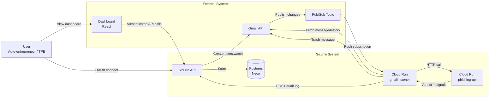

# System context (C4 L1)

```mermaid
flowchart LR
  U[User<br/>Auto-entrepreneur / TPE]

  subgraph SIC[Sicurre System]
    API[Sicurre API]
    ING[Cloud Run<br/>gmail-listener]
    CLS[Cloud Run<br/>phishing-api]
    DB[(Postgres<br/>Neon)]
  end

  subgraph EXT[External Systems]
    GM[Gmail API]
    PS[Pub/Sub Topic]
    UI[Dashboard<br/>React]
  end

  U -->|OAuth connect| API
  U -->|View dashboard| UI
  UI -->|Authenticated API calls| API

  API -->|Create users.watch| GM
  GM -->|Publish changes| PS
  PS -->|Push subscription| ING

  ING -->|Fetch message/history| GM
  ING -->|HTTP call| CLS
  CLS -->|Verdict + signals| ING
  ING -->|Trash message| GM
  ING -->|POST audit log| API
  API -->|Store| DB
```