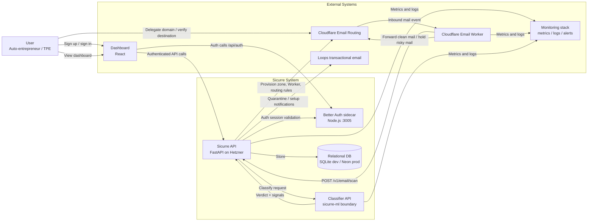

# System context (C4 L1)

```mermaid
flowchart LR
  U[User<br/>Auto-entrepreneur / TPE]

  subgraph SIC[Sicurre System]
    API[Sicurre API<br/>FastAPI on Hetzner]
    AUTH[Better Auth sidecar<br/>Node.js :3005]
    CLS[Classifier API<br/>sicurre-ml boundary]
    DB[(Relational DB<br/>SQLite dev / Neon prod)]
  end

  subgraph EXT[External Systems]
    CF[Cloudflare Email Routing]
    WORKER[Cloudflare Email Worker]
    LOOPS[Loops transactional email]
    UI[Dashboard<br/>React]
    MON[Monitoring stack<br/>metrics / logs / alerts]
  end

  U -->|Sign up / sign in| UI
  UI -->|Auth calls /api/auth| AUTH
  U -->|View dashboard| UI
  UI -->|Authenticated API calls| API

  U -->|Delegate domain / verify destination| CF
  API -->|Provision zone, Worker, routing rules| CF
  CF -->|Inbound mail event| WORKER
  WORKER -->|POST /v1/email/scan| API

  API -->|Classify request| CLS
  CLS -->|Verdict + signals| API
  API -->|Store| DB
  API -->|Auth session validation| AUTH
  API -->|Quarantine / setup notifications| LOOPS
  WORKER -->|Forward clean mail / hold risky mail| CF

  API -->|Metrics and logs| MON
  WORKER -->|Metrics and logs| MON
  CLS -->|Metrics and logs| MON
```
